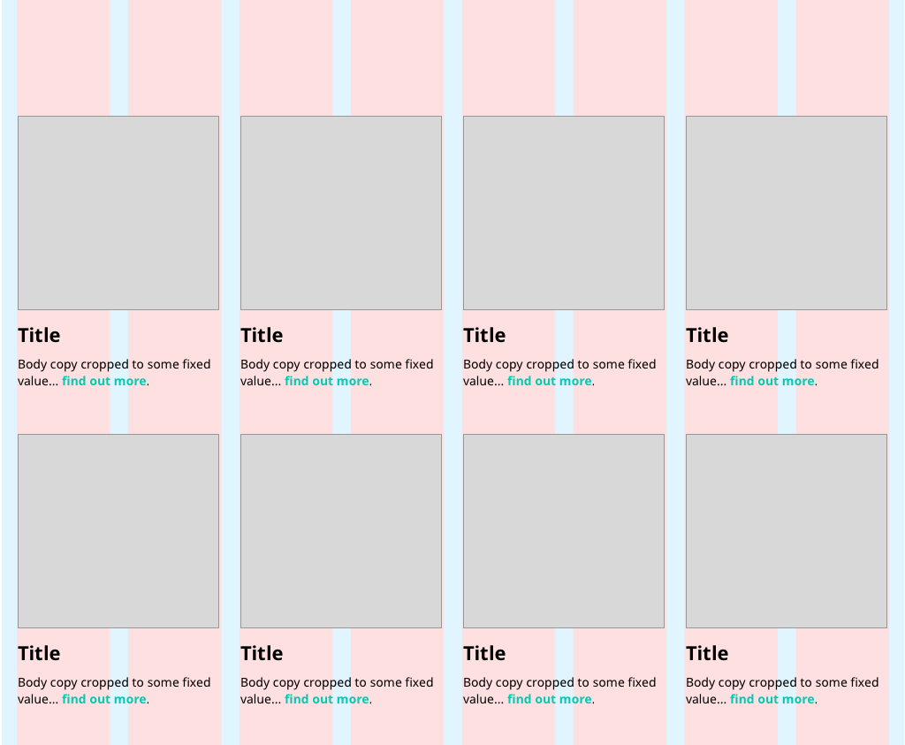

# Medical Data Look-Up - By Jon D Jones 💥

Return JSON data from a serverless function using Netlify Functions.  Conditions Data : `functions/data/conditions.json`

*As a user I would like to be able to see a list of conditions, so I can investigate potential illness.*

Use the framework provided to produce a single page web application that can load and display the contents of the supplied JSON file.

*As a client application I would like to be able to get conditions data via below endpoint.

[http://localhost:5000/api/conditions](http://localhost:5000/api/conditions)



- **Live Site**: [https://medical-lookup.netlify.app/](https://medical-lookup.netlify.app/)

- **Live API**: [https://medical-lookup.netlify.app/.netlify/functions/conditions](https://medical-lookup.netlify.app/.netlify/functions/conditions)]

[](https://app.netlify.com/sites/medical-lookup/deploys)

👾☄️👻👺🕹️

## Scripts

Install dependencies

```javascript
$ npm i
```

Run

```javascript
$ npm start
```

You should the be able to browse to [http://localhost:1234](http://localhost:1234)

Test

```javascript
$ npm run test
```

Simple restful api to provide the data.

```javascript
$ npm run backend
```

you should the be able to see running backend application here [http://localhost:5000/api/conditions]()

Dev

To start the frontend application and a simple backend application.

```javascript
$ npm run dev
```